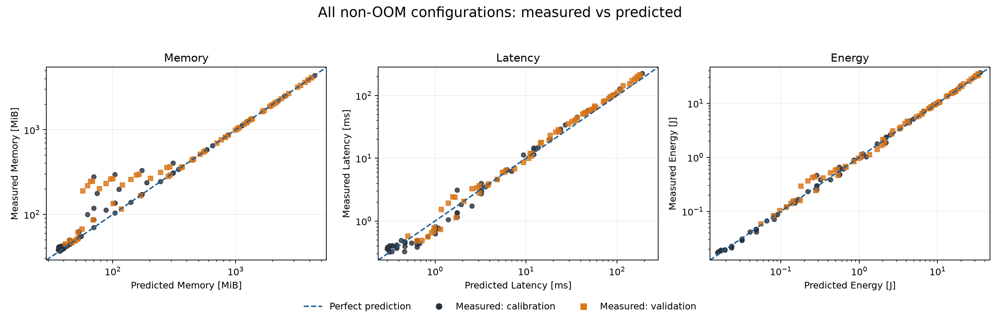
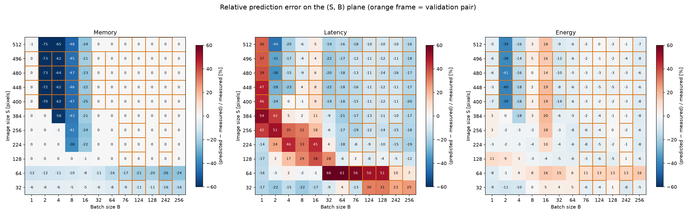
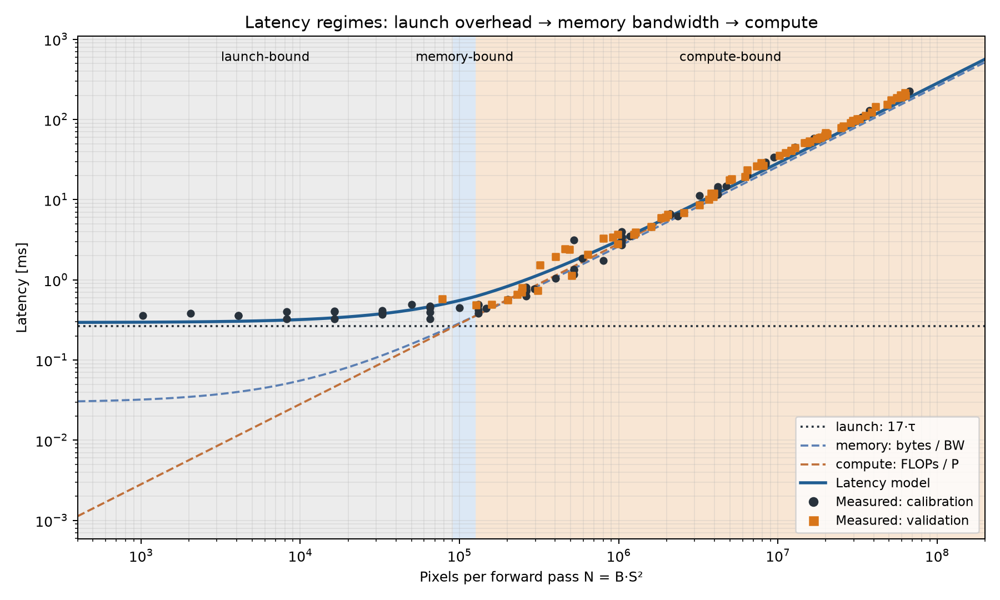
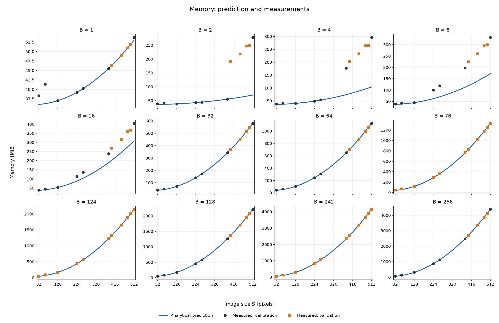
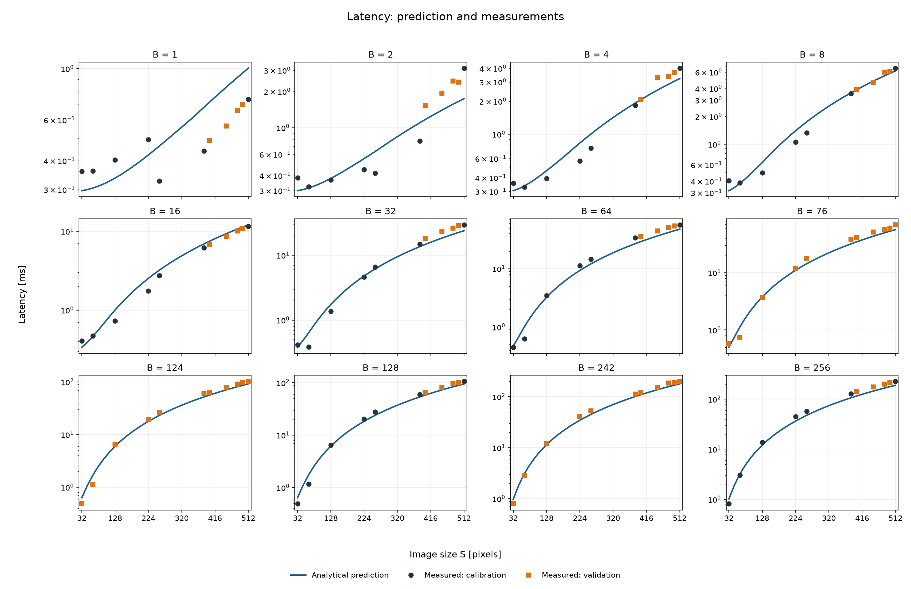
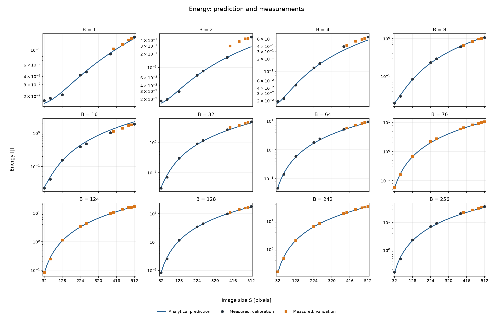
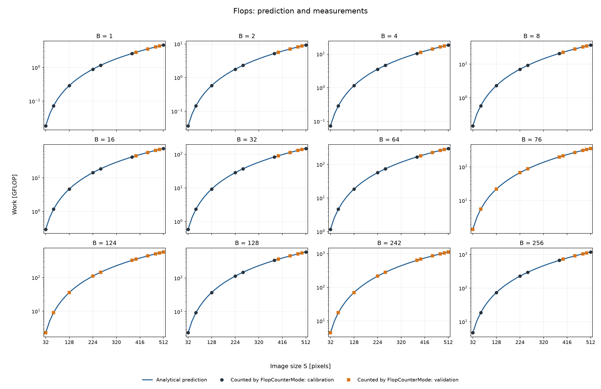
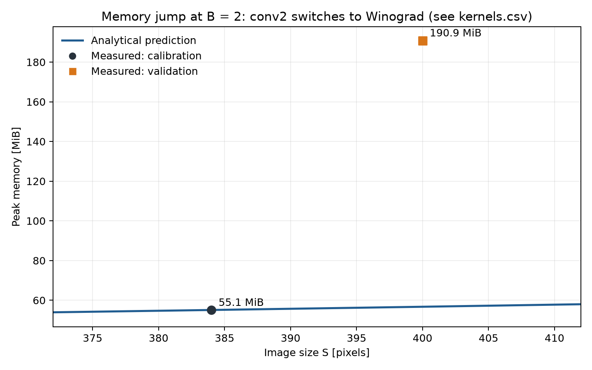
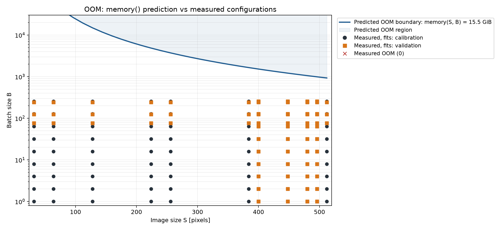

# HW1 — аналитическая модель производительности небольшой CNN

Для сети из `models.py` выведены четыре функции от размера изображения $S$ и батча $B$: `flops`, `memory`, `latency` и `energy` (`equations.py`). Они проверены на 132 конфигурациях, измеренных на реальном GPU. Вывод формул от руки находится в `hw1_handwritten.pdf`.

## Оборудование и ПО

| | |
|---|---|
| GPU | NVIDIA GeForce RTX 5060 Ti, 16 ГБ GDDR7 (Blackwell, sm_120), лимит мощности 180 Вт |
| Пиковые характеристики | ≈ 23,7 TFLOP/s FP32, 448 ГБ/с |
| Драйвер | 595.84 |
| CUDA / cuDNN | 13.0 (сборка PyTorch) / 9.24.0 |
| PyTorch | 2.14.0+cu130 |
| Python | 3.13.14 |
| NumPy / SciPy / pandas / Matplotlib | 2.5.3 / 1.18.1 / 3.0.6 / 3.11.2 |
| ОС | Linux Mint 22.3, ядро 6.14 |

Точные версии всех пакетов перечислены в `requirements.txt`.

## Воспроизведение

Все команды выполняются из каталога `hw1`:

```bash
python3 -m venv .venv
source .venv/bin/activate
pip install -r requirements.txt

python measure.py                 # ≈15 мин: все 132 конфигурации -> results/measurements.csv и results/kernels.csv
python calibrate.py               # подбор θ по базовой сетке -> results/theta.json
python plot_results.py            # графики -> results/figures/*.png, MAPE в консоль
```

- `python measure.py --kernels-only` (≈20 с) заново собирает только `results/kernels.csv`, не трогая измерения.
- `python measure.py --test-hyp` проверяет пик памяти при `B=2` для `S=384` и `S=400` в отдельных процессах.

Протокол измерений:
- `cudnn.benchmark=False`, TF32 выключен, FP32, `model.eval()`, `torch.inference_mode()`.
- На входе случайные тензоры.
- Перед замерами 5 прогревочных проходов.
- **Время** — медиана 20 проходов, измеренных CUDA events.
- **Память** — `torch.cuda.max_memory_allocated()` за один проход после `reset_peak_memory_stats()`. Веса и входной тензор тоже входят в пик.
- **Энергия** — разность счётчика NVML `total_energy_consumption` для всего GPU, делённая на число проходов. Проходы идут подряд не меньше 2 с, берётся медиана трёх повторов.
- `torch.cuda.OutOfMemoryError` перехватывается, конфигурация помечается как `oom=True`.

## Сетка и разбиение на калибровку и проверку

- Базовая сетка: $S \in \{32, 64, 128, 224, 256, 384, 512\}$, $B \in \{1, 2, 4, 8, 16, 32, 64, 128, 256\}$.
- Случайные значения (seed 676767): $S \in \{400, 448, 480, 496\}$, $B \in \{76, 124, 242\}$.

Всего получается 11 × 12 = 132 конфигурации.

θ калибруется **только на 63 конфигурациях базовой сетки** (`is_validation=False`). Проверка идёт на 69 парах, где случайно выбран $S$ или $B$ (`is_validation=True`). Такие значения $S$ и $B$ при калибровке не встречались вообще.

## Формулы и допущения

**FLOPs.** Одно умножение с накоплением считается как 2 FLOPs. Учитываются свёртки, Linear без смещений (они добавляют 356 FLOP на изображение, этим можно пренебречь) и GlobalAvgPool (1 FLOP на элемент). ReLU и MaxPool не считаются.

$$\mathrm{FLOPs}(S,B) = B\,(17714\,S^2 + 313344)$$

где $17714 = 2352_{\text{conv1}} + 6400_{\text{conv2}} + 2304_{\text{conv3}} + 1024_{\text{conv4}} + 4608_{\text{conv5}} + 1024_{\text{conv6}} + 2_{\text{GAP}}$, а $313344 = 2\,(512\cdot256 + 256\cdot100)$ приходится на классификатор.

**Память.** Пик `max_memory_allocated` достигается внутри MaxPool:

$$\mathrm{Memory}(S,B) = \underbrace{4\cdot 1\,040\,324}_{\text{веса FP32}} + \underbrace{2^{25}}_{\text{workspace cuBLAS}} + \underbrace{4\cdot(3+8+2)\,B S^2}_{\text{вход, выход conv1, выход MaxPool}} + \underbrace{8\cdot 2\,B S^2}_{\text{индексы MaxPool, int64}} = 37\,715\,728 + 68\,B S^2 \ \text{байт}$$

- **Буфер cuBLAS.** PyTorch выделяет его через свой аллокатор при первом вызове Linear, поэтому `max_memory_allocated` его учитывает. На этом GPU он занимает ровно 32 MiB. Проверено: с `CUBLAS_WORKSPACE_CONFIG=:0:0` память после прохода при S=32, B=1 падает с 36,0 до 4,0 MiB.
- **Индексы MaxPool.** `max_pool2d` на CUDA всегда строит индексы максимумов типа int64, даже если они не возвращаются.
- **Буферы cuDNN не учитываются.** Их размер зависит от алгоритма, который cuDNN выбирает эвристикой, так что аналитически его не вывести (см. обсуждение).

**Объём переданных данных.** Каждый тензор активаций читается и пишется ровно один раз, веса читаются один раз, кэши не учитываются.

$$\mathrm{Bytes}(S,B) = 4\,(91\,B S^2 + 2148\,B + 1\,040\,324)$$

**Время.** Постоянные накладные расходы на 17 операций прямого прохода (ядра свёрток, ReLU, pooling и Linear) складываются с roofline для всей сети:

$$\mathrm{Latency}(S,B,\theta) = 17\,\tau + \max\!\left(\frac{\mathrm{FLOPs}}{P},\ \frac{\mathrm{Bytes}}{BW}\right)$$

**Энергия.** Энергия складывается из базовой мощности за время прохода, стоимости операций и стоимости переданных байтов. Время берётся предсказанное, а не измеренное:

$$\mathrm{Energy}(S,B,\theta) = P_0\cdot\mathrm{Latency} + e_F\cdot\mathrm{FLOPs} + e_B\cdot\mathrm{Bytes}$$

Время подбирается нелинейным МНК по логарифмам (`soft_l1`), энергия — неотрицательным МНК по относительной ошибке. Подобранные параметры (`results/theta.json`):

| τ | P | BW | $P_0$ | $e_F$ | $e_B$ |
|---:|---:|---:|---:|---:|---:|
| 15,6 мкс | 6,28 TFLOP/s | 141 ГБ/с | 51,3 Вт | 0,0212 Дж/GFLOP | 0 |

## Результаты

| Величина | MAPE, калибровка (63) | MAPE, проверка (69) |
|---|---:|---:|
| FLOPs (относительно `torch.utils.flop_counter.FlopCounterMode`) | 0,01 % | 0,01 % |
| Пиковая память | 10,4 % | 13,2 % |
| Время прохода | 20,8 % | 16,9 % |
| Энергия прохода | 7,1 % | 8,2 % |

FLOPs нельзя измерить так же, как время. Поэтому формула сверяется с независимым счётчиком PyTorch, который считает операции по каждому aten-оператору. Расхождение 0,01% — это GlobalAvgPool, который счётчик не учитывает.

`results/kernels.csv` содержит 2717 строк со столбцами S, B, слой и имя ядра. Каждый слой профилируется `torch.profiler` отдельно, поэтому ядро точно привязано к слою. За один проход запускается от 17 до 25 GPU-операций, медиана 21.







Графики по всем 12 значениям $B$ (линия — формула, точки — измерения):








## Обсуждение

**Режимы: launch-bound → memory-bound → compute-bound.** На графике `regimes.png` время показано как функция от числа пикселей за проход $N = B S^2$. Работа и трафик растут почти пропорционально $N$, поэтому все 132 точки ложатся примерно на одну кривую.

- **При $N \lesssim 5\cdot10^4$** время почти не зависит от размера: 0,32–0,42 мс в 12 конфигурациях. GPU простаивает в ожидании CPU, который по очереди отправляет операции. Модель описывает это слагаемым $17\tau = 0{,}26$ мс. Значение $\tau = 15{,}6$ мкс — это не только запуск ядра на GPU (единицы мкс), но и накладные расходы Python, диспетчера PyTorch и эвристик cuDNN на каждую операцию.
- **Режим memory-bound по модели занимает узкую полосу** $N \approx 0{,}9\text{–}1{,}3\cdot10^5$, где все три слагаемые почти равны, поэтому отдельного участка на измерениях не видно. Причина в том, что интенсивность всей сети ≈ 48,7 FLOP/байт почти совпадает с точкой перегиба подобранных параметров $P/BW \approx 44{,}6$ FLOP/байт. Поэтому обе асимптоты roofline почти параллельны, и глобальная модель плохо разделяет эти два режима. По слоям картина чёткая: у ReLU и MaxPool интенсивность меньше 0,5 FLOP/байт, это чистый memory-bound. У свёрток она от 43 (conv4, 1×1) до 267 (conv2, 5×5), это compute-bound: точка перегиба по паспорту около 53 FLOP/байт.
- **При $N \gtrsim 1{,}3\cdot10^5$** время растёт линейно по $N$: сеть ограничена вычислениями. Эффективная производительность 5–7,5 TFLOP/s, то есть 20–30% от пика. Для FP32-свёрток через implicit GEMM без tensor cores это ожидаемо.

**Где ошибается память.** Если cuDNN выбирает implicit GEMM, ошибка формулы не больше 1,4%. Все большие ошибки приходятся на конфигурации, где conv2 (5×5) исполняется **Winograd non-fused** (`winogradForwardData/Filter/Output9x9_5x5` в `kernels.csv`). Это все $B$ при $S \in \{32, 64\}$ и малые батчи при больших $S$: $B=8$–$16$ при $S=224$ и $256$, $B=4$–$16$ при $S=384$, $B=2$–$16$ при $S \ge 400$. Winograd требует рабочий буфер под преобразованные тайлы, которого нет в формуле. Отсюда и скачок при $B=2$: 55 MiB при $S=384$ против 191 MiB при $S=400$, недооценка до 75%. При $B \ge 32$ cuDNN снова выбирает implicit GEMM без буфера, и формула опять точна.

**Где ошибается время** (`error_heatmap.png`):
1. **Переход от launch-bound к compute-bound, $N \approx 10^5$–$10^6$.** Модель завышает время до +66% (S=64, B=32–128; S=224–256, B=2–16). Модель *складывает* накладные расходы и вычисления, но на деле CPU ставит ядра в очередь асинхронно, и накладные расходы прячутся за работой GPU. Пример: при S=64, B=64 измерено 0,63 мс, предсказано 1,01 мс.
2. **Winograd при $B=2$, $S \ge 400$.** Модель занижает время до −44%. При S=512, B=2 измерено 3,12 мс против 1,74 мс по модели: эффективные 3,0 TFLOP/s против 6,3 при B=1. Четыре отдельных ядра с проходами через рабочий буфер — это лишний трафик и лишние запуски, которых нет в формулах.
3. **Самые большие конфигурации.** Модель занижает время на 10–20%. Одна константа $P$ на всю сеть не учитывает, что эффективность разных слоёв различается: при S=512, B=256 получается 5,2 TFLOP/s против подобранных 6,3.

**Энергия.** Модель даёт мощность $P_0 + e_F\cdot P \approx 51 + 133 = 184$ Вт при полной загрузке. Это близко к лимиту 180 Вт; измеренная средняя мощность при S=512, B=256 — 165 Вт. Коэффициент $e_B$ получился нулевым, потому что байты и FLOPs во всех конфигурациях почти пропорциональны друг другу (обе величины ∝ $B S^2$). МНК не может разделить их вклад и переносит стоимость трафика в $e_F$, но это не значит, что передача данных ничего не стоит. Энергия считается через предсказанное время, поэтому ошибки энергии повторяют ошибки времени, самые большие — −40% в зоне Winograd при $B=2$.

**OOM.** Ни одна конфигурация не упала по памяти: максимум 4388 MiB (4,29 ГиБ) при S=512, B=256. Формула `memory` тоже предсказывает, что вся сетка помещается в 15,5 ГиБ GPU. Предсказанная граница OOM: $B_{\max} \approx 930$ при $S=512$ и около 4860 при $S=224$ (`oom_boundary.png`). Рядом с границей батчи большие, cuDNN использует implicit GEMM без рабочего буфера, и формула там точна до ~1%. Реальная граница будет немного ниже: часть памяти занимают контекст CUDA и дисплей.

**Ограничения модели.**
- Число операций зафиксировано на 17, хотя фактически их от 17 до 25.
- Roofline глобальный, а не по слоям.
- Нет слагаемого для рабочих буферов cuDNN.
- Накладные расходы запуска складываются с вычислениями, а не перекрываются с ними.
